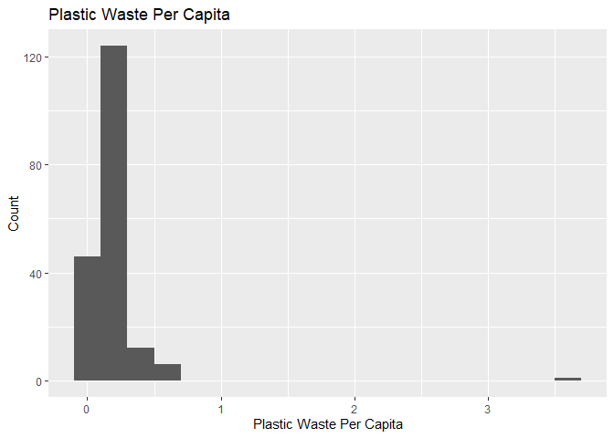
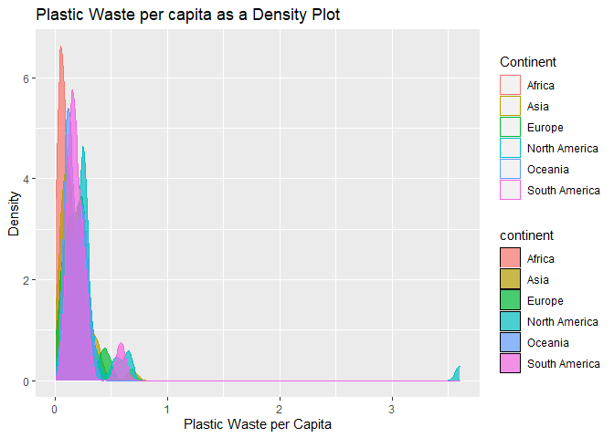
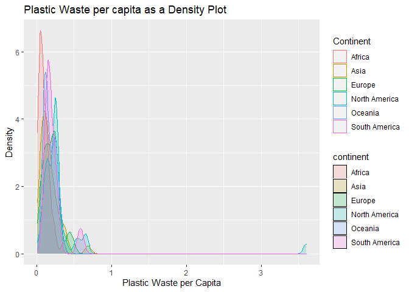
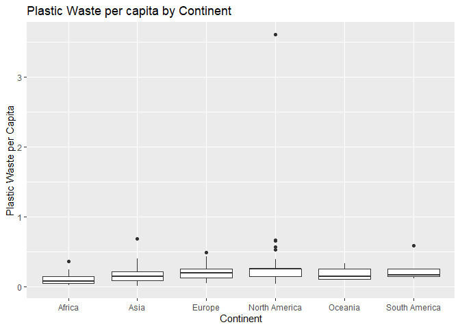
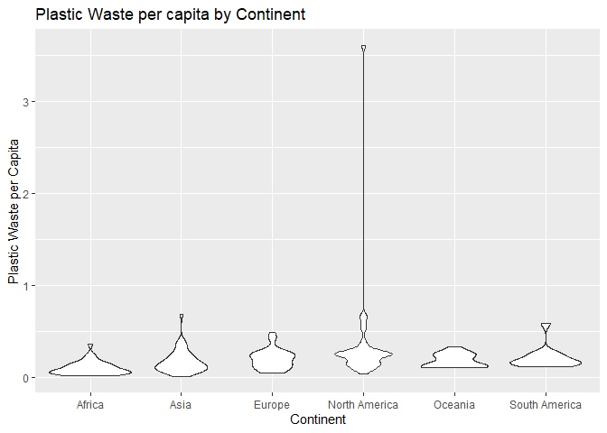
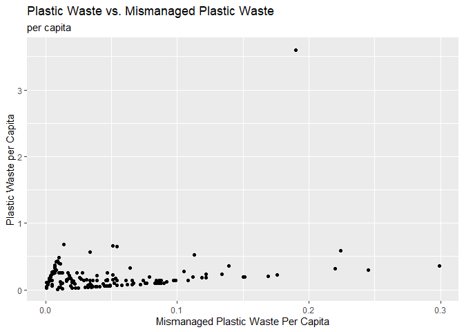
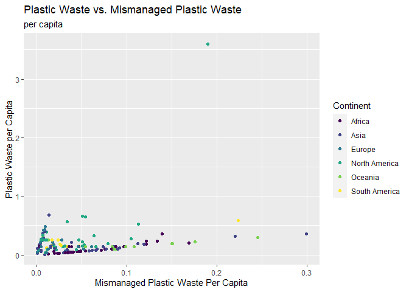
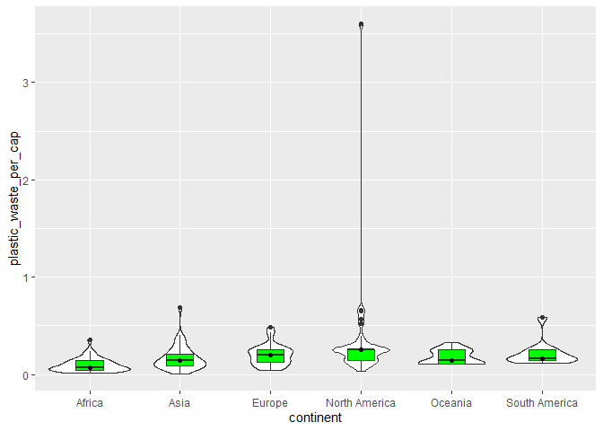

Lab 02 - Plastic waste
================
Adam Paul
2/11

## Load packages and data

``` r
library(tidyverse) 
```

``` r
plastic_waste <- read.csv("data/plastic-waste.csv")
```

# Exercises

## Exercise 1

The first thing the exercise has us do is look at the data broadly.

What the code below is doing, for my own sake, is using ggplot to create
a graph. Data = plastic\_waste picks out the dataset aes is aesthetics,
which is the basic layout of the graph, such as… x= what is on the
x-axis + indicates the next step in the process geom\_histogram is
picking out a histogram. geom indicates the family of graphical
procedures. Remember the documentation will have these different
commands, as will a google search. Binwidth picks how much data is
contained within each bar.

``` r
ggplot(data = plastic_waste, aes(x = plastic_waste_per_cap)) +
  geom_histogram(binwidth = 0.2) +
  labs(title = "Plastic Waste Per Capita",
       x = "Plastic Waste Per Capita",
       y = "Count")
```

    ## Warning: Removed 51 rows containing non-finite values (stat_bin).

<!-- -->

Looking at the graph, there’s an outlier way away from all the others.
One way we’re shown to find out what country is to filter for only
results that are above a cutoff point.

``` r
plastic_waste %>%
  filter(plastic_waste_per_cap > 3.5)
```

    ##   code              entity     continent year gdp_per_cap plastic_waste_per_cap
    ## 1  TTO Trinidad and Tobago North America 2010    31260.91                   3.6
    ##   mismanaged_plastic_waste_per_cap mismanaged_plastic_waste coastal_pop
    ## 1                             0.19                    94066     1358433
    ##   total_pop
    ## 1   1341465

This reveals that it is Trinidad and Tobago. Which means it’s finally
time for…

### Question 1

*1. Plot, using histograms, the distribution of plastic waste per capita
faceted by continent. What can you say about how the continents compare
to each other in terms of their plastic waste per capita?*

``` r
ggplot(data = plastic_waste, aes(x=plastic_waste_per_cap)) +
  geom_histogram(binwidth = 0.2) +
  facet_grid( ~ continent) +
  labs(title= "Waste per capita by Continent",
       x = "Plastic Waste per capita", 
       y = "Count")
```

    ## Warning: Removed 51 rows containing non-finite values (stat_bin).

<!-- -->

What I notice is that `North America`, `South America`, and `Asia` are
the only three that break .5 per capita. Of these three, the one with
the most (by a good margin) is `North America`.

The continent with the average appearing to be the lowest is `Africa`,
though that may be a consequence of lowest usage.

Uniquely, though there are some high producers in `Asia`, it comes the
next closest (on average) to lowest waste per capita.

### Question 2

For the next part, we’re looking the same information using a density
plot. Several iterations were presented, resulting in the code below.

``` r
ggplot(data = plastic_waste, 
       mapping = aes(x = plastic_waste_per_cap, 
                     color = continent, 
                     fill = continent)) +
  geom_density(alpha = 0.7) +
  labs(title = "Plastic Waste per capita as a Density Plot",
       x= "Plastic Waste per Capita",
       y= "Density",
       color = "Continent") #Why is this making a second legend instead of replacing?
```

    ## Warning: Removed 51 rows containing non-finite values (stat_density).

<!-- -->

However, we can improve upon this too.

*2.1. Recreate the density plots above using a different (lower) alpha
level that works better for displaying the density curves for all
continents.*

``` r
ggplot(data = plastic_waste, 
       mapping = aes(x = plastic_waste_per_cap, 
                     color = continent, 
                     fill = continent)) +
  geom_density(alpha = 0.2) +
  labs(title = "Plastic Waste per capita as a Density Plot",
       x= "Plastic Waste per Capita",
       y= "Density",
       color = "Continent") #Why is this making a second legend instead of replacing?
```

    ## Warning: Removed 51 rows containing non-finite values (stat_density).

<!-- -->

After exploring some, I found 0.2 to be a good number that reveals the
full set.

*2.2. Describe why we defined the color and fill of the curves by
mapping aesthetics of the plot but we defined the alpha level as a
characteristic of the plotting geom.*

We used aes for the color and fill of the curves because if we didn’t we
wouldn’t get the legend with information about what the colors mean.
defining alpha level as a characteristic is fine because we don’t need
to include it in the legend, as it is being done for visualization
purposes.

> However, not knowing what each colour means would make the graph
> basically useless.

### Question 3

Another way to visualize the data is with side-by-side box plots.

``` r
ggplot(data = plastic_waste, 
       mapping = aes(x = continent, 
                     y = plastic_waste_per_cap)) +
  geom_boxplot() +
  labs(title = "Plastic Waste per capita by Continent",
       x= "Continent",
       y= "Plastic Waste per Capita")
```

    ## Warning: Removed 51 rows containing non-finite values (stat_boxplot).

<!-- -->

*3.1. Convert your side-by-side box plots from the previous task to
violin plots. What do the violin plots reveal that box plots do not?
What features are apparent in the box plots but not in the violin
plots?*

``` r
ggplot(data = plastic_waste, 
       mapping = aes(x = continent, 
                     y = plastic_waste_per_cap)) +
  geom_violin() +
  labs(title = "Plastic Waste per capita by Continent",
       x= "Continent",
       y= "Plastic Waste per Capita")
```

    ## Warning: Removed 51 rows containing non-finite values (stat_ydensity).

<!-- -->

The violin plot reveals that there is a massive amount of skew in North
America. The boxplot lets us know the specific outlier locations, as
well as accurately marking the interquartile ranges.

### Question 4

*4.1. Visualize the relationship between plastic waste per capita and
mismanaged plastic waste per capita using a scatterplot. Describe the
relationship.*

``` r
ggplot(data = plastic_waste,
  mapping = aes(x= mismanaged_plastic_waste_per_cap,
                y = plastic_waste_per_cap)) +
  geom_point() +
labs(title = "Plastic Waste vs. Mismanaged Plastic Waste",
     subtitle = "per capita",
       x= "Mismanaged Plastic Waste Per Capita",
       y= "Plastic Waste per Capita")
```

    ## Warning: Removed 51 rows containing missing values (geom_point).

<!-- -->

There is an extremely subtle relationship between mismanaged plastic
waste per capita and plastic waste per capita but it is hard to notice.

*4.2. color the points in the scatterplot by continent. Does there seem
to be any clear distinctions between continents with respect to how
plastic waste per capita and mismanaged plastic waste per capita are
associated?*

``` r
ggplot(data = plastic_waste,
  mapping = aes(x= mismanaged_plastic_waste_per_cap,
                y = plastic_waste_per_cap,
                color = continent)) +
  geom_point() +
  scale_color_viridis_d() +
labs(title = "Plastic Waste vs. Mismanaged Plastic Waste",
     subtitle = "per capita",
       x= "Mismanaged Plastic Waste Per Capita",
       y= "Plastic Waste per Capita",
     color = "Continent")
```

    ## Warning: Removed 51 rows containing missing values (geom_point).

<!-- -->

`North America` seems to have the most inconsistent relationship between
the two variables, whereas `Africa` and `Asia` have very linear
relationships. `Europe` has a distinct relationship between waste and
mismanaged waste from other continents, where it goes up considerably in
waste compared to other continents but without a corresponding increase
in mismanaged plastic waste per capita.

*4.3. Visualize the relationship between plastic waste per capita and
total population as well as plastic waste per capita and coastal
population. You will need to make two separate plots. Do either of these
pairs of variables appear to be more strongly linearly associated?*

**Total population**

``` r
ggplot(data = plastic_waste,
  mapping = aes(x= total_pop,
                y = plastic_waste_per_cap)) +
  geom_point() +
labs(title = "Plastic Waste per capita by Total Population",
       x= "Total Population",
       y= "Plastic Waste per Capita")
```

    ## Warning: Removed 61 rows containing missing values (geom_point).

<!-- -->

**Coastal population**

``` r
ggplot(data = plastic_waste,
  mapping = aes(x= coastal_pop,
                y = plastic_waste_per_cap)) +
  geom_point() +
labs(title = "Plastic Waste per capita by Coastal Population",
       x= "Coastal Population",
       y= "Plastic Waste per Capita")
```

    ## Warning: Removed 51 rows containing missing values (geom_point).

<!-- -->

`Coastal pop` seems to have a more strongly correlated relationship with
plastic waste, such that the less coastal a population is, the less
waste they produce.

## Pro-Tips

I freely admit I did not touch this latter task, but I am focused on
catching up and presenting quality work.

### Excercise 3

Try this :D

``` r
ggplot(data = plastic_waste, 
       mapping = aes(x = continent, 
                     y = plastic_waste_per_cap)) +
  geom_violin()+
  geom_boxplot(width=.3, fill="green") +
  stat_summary(fun.y=median, geom="point") 
```

    ## Warning: `fun.y` is deprecated. Use `fun` instead.

    ## Warning: Removed 51 rows containing non-finite values (stat_ydensity).

    ## Warning: Removed 51 rows containing non-finite values (stat_boxplot).

    ## Warning: Removed 51 rows containing non-finite values (stat_summary).

<!-- -->

### Exercise 5

Helpful
reference:<http://www.sthda.com/english/wiki/ggplot2-themes-and-background-colors-the-3-elements>
